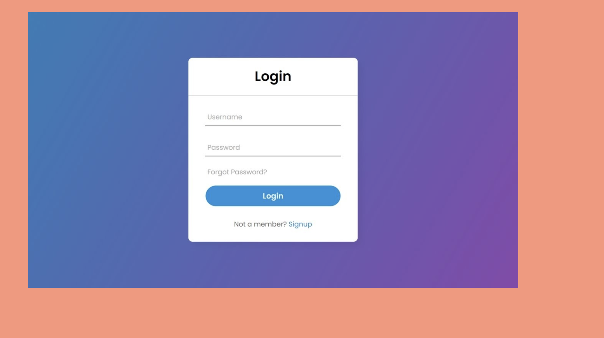
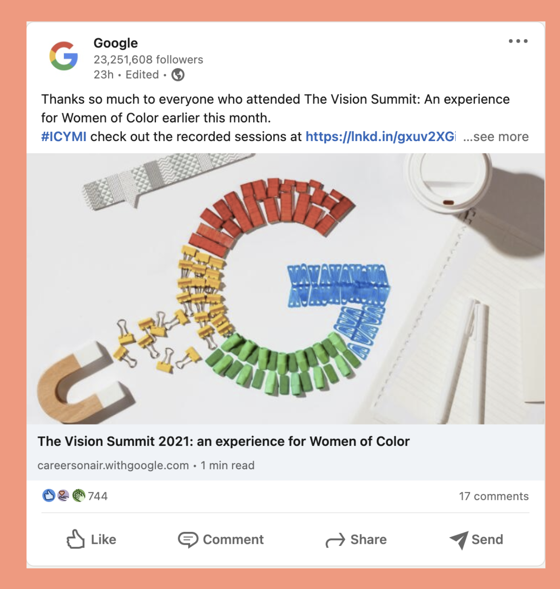

## Solutions
### Solutions are made using Sandbox.

| Assignment Number        | Link         | 
| ------------- |:-------------:| 
|1 |  [Assignment 1](https://codesandbox.io/s/eager-merkle-wh9kj?file=/src/styles.css&resolutionWidth=825&resolutionHeight=677)|
|2|[Assignment 2](https://codesandbox.io/s/keen-lamport-gy1nw)|

## Assignment-1 (Login Screen)
For the first assigment, you need to prepare a login screen which is centered on the screen.

### Evaluation Criterion
- You need to use class, id or attribute selector. Do not use inline styles.
- You need to use flexbox.
- You need to center login card both vertically and horizontally.
- All elements inside the login card should be centered.
- For bonus points, you need to give pay extra attention to the colors, border radius fonts.

## Assignment-2 (Linkedin Post)
For this assigment, you need to prepare a Linkedin post.

### Evaluation Criterion
- You need to use class, id or attribute selector. Do not use inline styles.
- You need to use flexbox.
- Elements should be placed roughly as you see in the picture below.
- For bonus points, you need to give pay extra attention to the colors, border radius and fonts.

## Assignment-3 (JS Practice)
This assigment is about JS. All the steps you need to complete written in app.js file.
